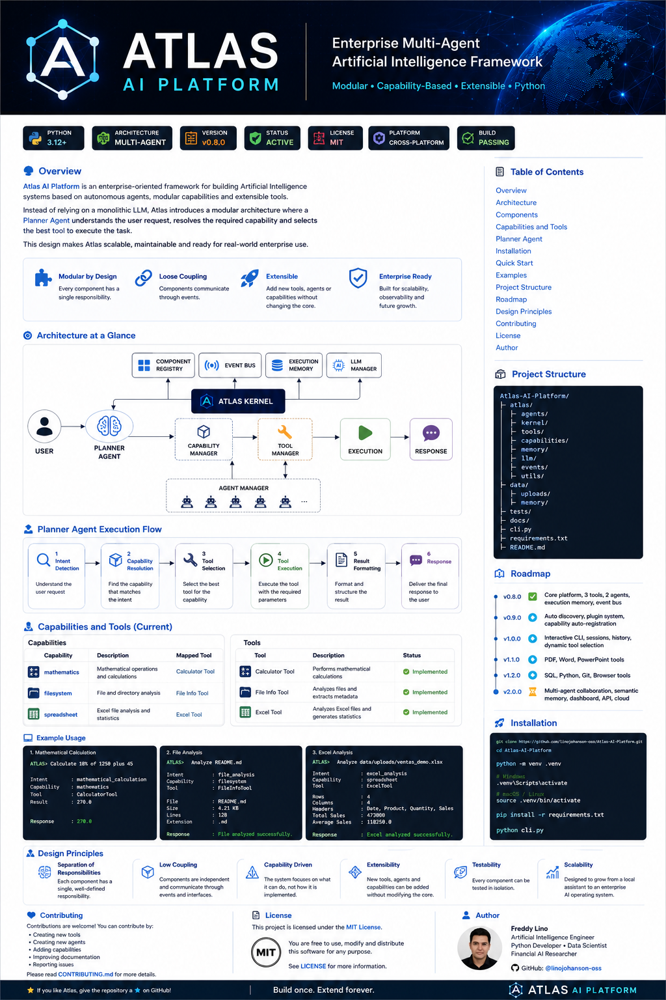
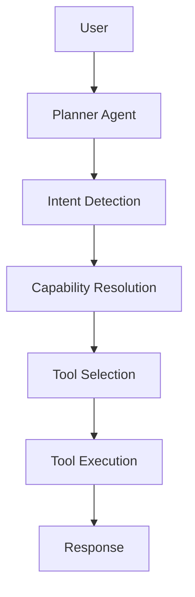

<p align="center">



</p>

<h1 align="center">
Atlas AI Platform
</h1>

<h3 align="center">
Enterprise Multi-Agent Artificial Intelligence Framework
</h3>

<p align="center">

Modular • Capability-Based • Tool Driven • Extensible • Enterprise Ready

</p>

<p align="center">


</p>

---

# Atlas AI Platform

Atlas AI Platform is an enterprise-grade framework for building modular Artificial Intelligence systems based on autonomous agents, capabilities and extensible tools.

Unlike traditional chatbot architectures, Atlas separates planning, reasoning, capability resolution and tool execution into independent layers, allowing the platform to evolve without modifying its core.

Atlas is designed following software engineering principles first, making it scalable, maintainable and ready for enterprise environments.

---

# Vision

Atlas is not intended to become another chatbot.

Its goal is to evolve into an Artificial Intelligence Operating System capable of coordinating multiple specialized agents that collaborate dynamically through capabilities and tools.

---

# Why Atlas?

Traditional AI applications usually follow this flow:

```
User
   │
   ▼
Language Model
   │
   ▼
Response
```

Atlas introduces multiple abstraction layers:

```
User
   │
   ▼
Planner Agent
   │
   ▼
Intent Detection
   │
   ▼
Capability Resolution
   │
   ▼
Tool Selection
   │
   ▼
Tool Execution
   │
   ▼
Language Model (only when required)
   │
   ▼
Response
```

This architecture allows the platform to grow from a local assistant into a complete multi-agent ecosystem.

---

# Architecture



---

# Core Components

## Atlas Kernel

The Atlas Kernel orchestrates the entire platform.

Responsibilities include:

- Component registration
- Agent registration
- Tool registration
- Capability registration
- Execution memory
- Event publishing
- Platform lifecycle

---

## Component Registry

Stores references to every subsystem.

- Event Bus
- Tool Manager
- Agent Manager
- Capability Manager
- LLM Manager
- Execution Memory

---

## Event Bus

Atlas follows an event-driven architecture.

Every important operation generates events that can later be consumed by monitoring, analytics or future distributed components.

---

## Execution Memory

Every execution performed by Atlas is automatically stored.

Current metadata includes:

- Timestamp
- Agent
- Intent
- Capability
- Selected Tool
- Provider
- Model
- Result

Future versions will include semantic memory and vector search.

---

## LLM Manager

Provides an abstraction layer for language models.

Current provider:

- Mock Provider

Future providers:

- OpenAI
- Anthropic Claude
- Google Gemini
- Ollama
- Local Models

Changing providers never affects the platform architecture.

---

## Agent Manager

Current agents:

- Planner Agent
- General Agent

Future roadmap:

- Research Agent
- Finance Agent
- Coding Agent
- Vision Agent
- Automation Agent
- Data Agent

---

## Capability Manager

Capabilities describe **what Atlas can do**.

Current capabilities:

| Capability | Tool |
|------------|------|
| mathematics | Calculator Tool |
| filesystem | File Info Tool |
| spreadsheet | Excel Tool |

Future capabilities:

- Documents
- Database
- Browser
- Git
- Python
- Email
- Calendar
- Vision

---

## Tool Manager

Current tools:

- Calculator Tool
- File Info Tool
- Excel Tool

Planned tools:

- PDF Tool
- Word Tool
- PowerPoint Tool
- CSV Tool
- SQL Tool
- Git Tool
- Browser Tool
- Weather Tool

Every tool follows the same execution interface, making the platform highly extensible.

---

# Planner Agent

The Planner Agent transforms natural language into executable actions.

Execution pipeline:

```
User Request
      │
      ▼
Intent Detection
      │
      ▼
Capability Resolution
      │
      ▼
Tool Selection
      │
      ▼
Execution
      │
      ▼
Result Formatting
      │
      ▼
Response
```

The Planner never depends on concrete tool implementations.

It only knows capabilities.

---

# Installation

```bash
git clone https://github.com/linojohanson-oss/Atlas-AI-Platform.git

cd Atlas-AI-Platform

python -m venv .venv

pip install -r requirements.txt

python cli.py
```

---

# Example

```python
from atlas import AtlasKernel

kernel = AtlasKernel()

kernel.start()

result = kernel.execute(
    "Analyze data/uploads/ventas_demo.xlsx"
)

print(result["output"])
```

Example output:

```
Excel analyzed

Rows: 4

Columns: 4

Statistics generated

Totals calculated
```

---

# Project Structure

```
Atlas-AI-Platform

├── atlas
│   ├── agents
│   ├── kernel
│   ├── tools
│   ├── memory
│   ├── llm
│   ├── config
│   └── utils
│
├── docs
│   └── images
│
├── data
│
├── tests
│
├── cli.py
│
├── requirements.txt
│
└── README.md
```

---

# Roadmap

## Version 0.9

- Automatic Tool Discovery
- Automatic Agent Discovery
- Plugin System
- Capability Auto Registration

## Version 1.0

- Interactive CLI
- Dynamic Tool Selection
- Conversation Sessions
- Session Memory

## Version 1.1

- PDF Tool
- Word Tool
- PowerPoint Tool

## Version 1.2

- SQL Tool
- Python Tool
- Git Tool
- Browser Tool

## Version 2.0

- Multi-Agent Collaboration
- Semantic Memory
- Knowledge Graph
- REST API
- Docker Support
- Cloud Deployment

---

# Design Principles

Atlas follows software engineering principles before AI trends.

Core principles:

- Separation of Responsibilities
- Low Coupling
- High Cohesion
- Capability-Oriented Architecture
- Event-Driven Design
- Extensibility
- Maintainability
- Enterprise Scalability

---

# Contributing

Contributions are welcome.

Areas where contributions are especially appreciated:

- New agents
- New tools
- New capabilities
- LLM providers
- Performance improvements
- Documentation

---

# License

This project is distributed under the MIT License.

---

# Author

## Freddy Lino

Artificial Intelligence Engineer

Python Developer

Data Scientist

GitHub:

https://github.com/linojohanson-oss

---

<p align="center">

## Atlas AI Platform

### **Build once. Extend forever.**

Enterprise Multi-Agent Artificial Intelligence Framework

</p>